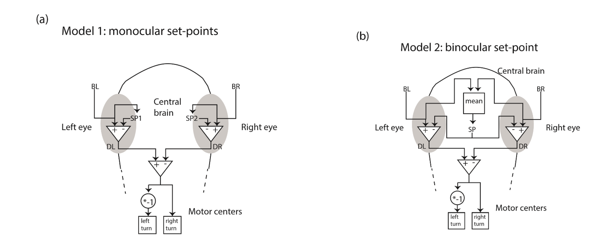

# brightfish 🔆🐟

## Introduction
A simulated zebrafish responding to brightness in the environment. The fish will update a set point of brightness to the average luminance observed by both eyes, and turn with higher probability in the direction closer to the internal set point. That is, the fish should find regions of the environment that are not too bright or not too dark. The model is described in the following image:

